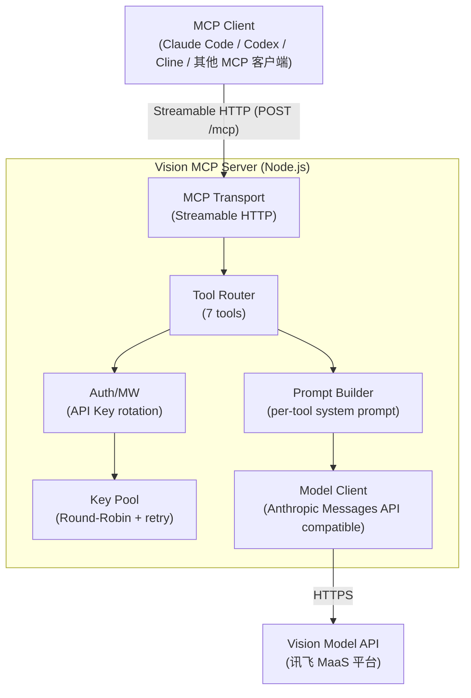
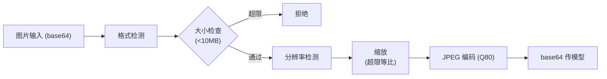

# Vision MCP Server 设计文档

> 日期: 2026-07-15
> 状态: 已确认

## 概述

Vision MCP Server 是一个远程部署的 MCP (Model Context Protocol) 服务器，基于讯飞 MaaS 平台的视觉理解模型，为 Claude Code、Codex 等 MCP 兼容客户端提供图像分析能力。

## 需求

- 远程服务器部署，支持 100 路并发
- 支持 Claude Code、Codex、Cline 等 MCP 客户端
- 多 API Key 轮询 + 失败重试
- 7 个专用视觉工具（不含视频分析）
- Streamable HTTP 传输协议

## 模型 API 信息

- **Anthropic 兼容端点**: `https://maas-coding-api.cn-huabei-1.xf-yun.com/anthropic`
- **OpenAI 兼容端点**: `https://maas-coding-api.cn-huabei-1.xf-yun.com/v2`
- **模型 ID**: `xopkimik26`
- **API 格式**: Anthropic Messages API (`POST /v1/messages`)
- **图片传入方式**: 仅支持 base64（URL 方式返回 400 错误）
- **上下文窗口**: 256K tokens

### 关键测试结论

- Token 消耗只和图片分辨率有关，与文件大小无关
- 665×1477 截图 → 1292 tokens → 256K 可容纳 ~198 张
- 2048×2048 图片 → ~4241 tokens → 256K 可容纳 ~60 张
- JPEG 压缩（质量80）可将 base64 体积减少 ~85%，加速网络传输但不影响 token

## 架构



### 核心组件

1. **MCP Transport Layer** — Streamable HTTP，监听端口，处理 MCP 协议握手和消息
2. **Tool Router** — 注册 7 个工具，根据工具名路由到对应处理器
3. **Prompt Builder** — 每个工具有专属 system prompt，将用户图片+问题组装成模型请求
4. **Key Pool** — 多 API Key 轮询管理，Round-Robin 分配 + 故障 Key 临时剔除
5. **Model Client** — 封装 Anthropic Messages API 兼容的 HTTP 调用，含重试逻辑
6. **Image Processor** — 图片预处理（分辨率控制 + JPEG 编码）

## 图片处理策略

**核心原则：Token 消耗 ∝ 分辨率，与文件大小无关**

### 处理流程



### 分辨率控制

| 场景 | 分辨率上限 | 预估 tokens | 256K 可容纳 |
|------|-----------|-------------|------------|
| 标准模式 | 2048×2048 | ~4241 | ~60 张 |
| OCR 模式 | 4096×4096 | ~16964 | ~15 张 |
| ui_diff_check（2张） | 每张 1536×1536 | ~2390×2 | ~53 组 |

### 支持格式

- 输入：PNG、JPEG、GIF（首帧）、WebP、BMP
- 统一转 JPEG 发送（质量 80，最小体积）
- OCR 场景保留更高分辨率（4096×4096）

## 7 个工具设计

### 1. `ui_to_artifact` — UI 截图转代码

- **输入**: `image`（base64）、`task`（code/prompt/design-spec/description）
- **输出**: 根据目标返回代码/提示词/设计规范/描述
- **分辨率**: 标准模式 (2048)

### 2. `extract_text_from_screenshot` — OCR 文字提取

- **输入**: `image`（base64）、`language`（可选，语言提示）
- **输出**: 提取的文字内容，保留原始布局
- **分辨率**: OCR 模式 (4096)，文字识别需要更高分辨率

### 3. `diagnose_error_screenshot` — 错误截图诊断

- **输入**: `image`（base64）、`context`（可选，额外上下文描述）
- **输出**: 错误定位 + 修复建议
- **分辨率**: 标准模式 (2048)

### 4. `understand_technical_diagram` — 技术图表理解

- **输入**: `image`（base64）、`diagram_type`（可选：architecture/flowchart/uml/er/general）
- **输出**: 结构化解读文本
- **分辨率**: 标准模式 (2048)

### 5. `analyze_data_visualization` — 数据可视化分析

- **输入**: `image`（base64）、`analysis_focus`（可选：trends/anomalies/summary/all）
- **输出**: 趋势、异常、业务要点
- **分辨率**: 标准模式 (2048)

### 6. `ui_diff_check` — UI 对比检查

- **输入**: `image_before`（base64）、`image_after`（base64）、`focus`（可选：关注点）
- **输出**: 视觉差异列表 + 严重程度
- **分辨率**: 每张 1536×1536（两张图共享上下文）

### 7. `image_analysis` — 通用图像分析

- **输入**: `image`（base64）、`question`（分析问题）
- **输出**: 根据问题的分析结果
- **分辨率**: 标准模式 (2048)

### 图片输入统一格式

```typescript
type ImageInput = {
  /** base64 编码的图片数据（必填） */
  base64: string;
  /** 图片的 MIME 类型提示（可选，默认自动检测） */
  mimeType?: string;
};
```

客户端（如 Claude Code）会自动将本地文件读成 base64 传入。不支持 URL 方式（模型 API 不支持从 URL 拉取图片，已测试验证）。

## API Key 轮询与失败重试

### 轮询策略

1. **Round-Robin** — 请求依次分配给不同 Key，均匀分摊负载
2. **故障剔除** — 401/403/429 时标记 Key 为 `cooldown` 状态，冷却期内不再分配
3. **自动恢复** — 冷却期（默认 60s）过后，Key 重新进入可用池
4. **全部不可用** — 返回 503，提示所有 Key 暂时不可用

### 配置

```typescript
interface KeyPoolConfig {
  keys: string[];           // 多个 API Key，逗号分隔
  maxRetries: number;       // 单次请求最大重试次数，默认 3
  cooldownMs: number;       // 故障 Key 冷却时间，默认 60000
  retryDelayMs: number;     // 重试基础延迟，默认 1000
  maxRetryDelayMs: number;  // 最大重试延迟，默认 10000
}
```

### 失败重试策略

| 错误 | 处理 |
|------|------|
| 401/403 | 标记 Key cooldown，换 Key 重试 |
| 429 (Rate Limit) | 标记 Key cooldown，换 Key 重试 |
| 500/502/503 | 指数退避重试 |
| 网络超时 | 指数退避重试 |
| 其他错误 | 不重试，直接返回错误 |

**指数退避公式**: `delay = min(baseDelay * 2^attempt + random_jitter, maxDelay)`

### 并发控制

- 全局最大并发: 100
- Per-Key 最大并发: 20（可配置）
- 超出限制排队等待，超时返回 503

## 技术栈

- **语言**: TypeScript
- **MCP SDK**: `@modelcontextprotocol/sdk` ^1.26.0
- **校验**: `zod` ^3.23
- **图片处理**: `sharp`
- **日志**: `pino`
- **运行时**: Node.js 20+

## 部署

### Docker

```dockerfile
FROM node:20-slim
WORKDIR /app
COPY package*.json ./
RUN npm ci --production
COPY . .
RUN npm run build
EXPOSE 3000
ENV PORT=3000
CMD ["node", "build/index.js"]
```

### 环境变量

| 变量 | 说明 | 默认值 |
|------|------|--------|
| `PORT` | 服务端口 | `3000` |
| `API_KEYS` | API Key 列表，逗号分隔 | 必填 |
| `API_BASE_URL` | 模型 API 基础 URL | `https://maas-coding-api.cn-huabei-1.xf-yun.com/anthropic` |
| `MODEL_ID` | 模型 ID | `xopkimik26` |
| `MAX_CONCURRENCY` | 最大并发数 | `100` |
| `MAX_RETRIES` | 最大重试次数 | `3` |
| `KEY_COOLDOWN_MS` | Key 冷却时间(ms) | `60000` |
| `PER_KEY_CONCURRENCY` | 每 Key 最大并发 | `20` |
| `IMAGE_MAX_SIZE_MB` | 图片最大体积(MB) | `10` |
| `IMAGE_MAX_DIMENSION` | 标准模式图片最大分辨率 | `2048` |
| `IMAGE_OCR_MAX_DIMENSION` | OCR 模式图片最大分辨率 | `4096` |
| `LOG_LEVEL` | 日志级别 | `info` |

### 客户端配置

**Claude Code:**
```bash
claude mcp add -s user vision-mcp-server \
  --transport http \
  https://your-server:3000/mcp
```

**手动配置 (.claude.json / 其他客户端):**
```json
{
  "mcpServers": {
    "vision-mcp-server": {
      "type": "http",
      "url": "https://your-server:3000/mcp"
    }
  }
}
```

### 健康检查

```
GET /health → {
  "status": "ok",
  "keys": { "total": 5, "available": 4, "cooldown": 1 },
  "concurrency": { "current": 23, "max": 100 }
}
```

## 项目结构

```
vision-mcp-server/
├── src/
│   ├── index.ts              # 入口：启动 Streamable HTTP 服务器
│   ├── server.ts             # MCP Server 注册 + 工具注册
│   ├── config.ts             # 环境变量配置 + 校验
│   ├── tools/
│   │   ├── index.ts          # 工具注册入口
│   │   ├── ui-to-artifact.ts
│   │   ├── extract-text.ts
│   │   ├── diagnose-error.ts
│   │   ├── understand-diagram.ts
│   │   ├── analyze-dataviz.ts
│   │   ├── ui-diff-check.ts
│   │   └── image-analysis.ts
│   ├── prompts/
│   │   └── index.ts          # 各工具的 system prompt 定义
│   ├── services/
│   │   ├── model-client.ts   # 模型 API 调用封装（含重试）
│   │   ├── key-pool.ts       # API Key 轮询池
│   │   └── image-processor.ts # 图片预处理（缩放+JPEG编码）
│   ├── transport/
│   │   └── streamable-http.ts # Streamable HTTP 传输层
│   └── utils/
│       ├── logger.ts         # 结构化日志
│       └── errors.ts         # 自定义错误类型
├── Dockerfile
├── docker-compose.yml
├── package.json
├── tsconfig.json
└── README.md
```

## 错误处理

| 错误类型 | 处理方式 | 返回给客户端 |
|----------|---------|-------------|
| 图片格式不支持 | 拒绝请求 | "不支持的图片格式，支持: PNG/JPEG/WebP/BMP/GIF" |
| 图片超过 10MB | 拒绝请求 | "图片过大，上限 10MB" |
| 所有 API Key 不可用 | 返回 503 | "所有 API Key 暂时不可用，请稍后重试" |
| 模型 API 超时 | 重试 3 次后返回 | "模型服务暂时不可用，请稍后重试" |
| 模型返回错误 | 解析错误码，友好提示 | 具体错误信息 |
| 请求并发超限 | 排队等待，超时返回 | "服务繁忙，请稍后重试" |

## 不在范围内

- 视频分析（明确排除）
- 用户认证/鉴权（MCP 层面暂不实现，可通过网络层限制）
- 图片持久化存储（仅内存/临时处理）
- WebSocket 传输（仅 Streamable HTTP）
